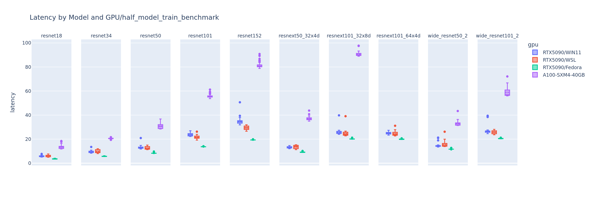
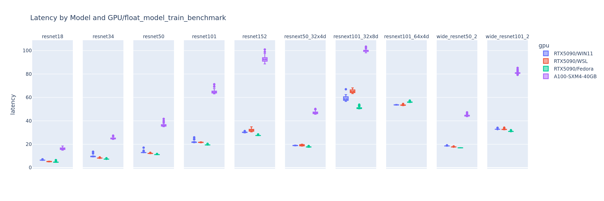
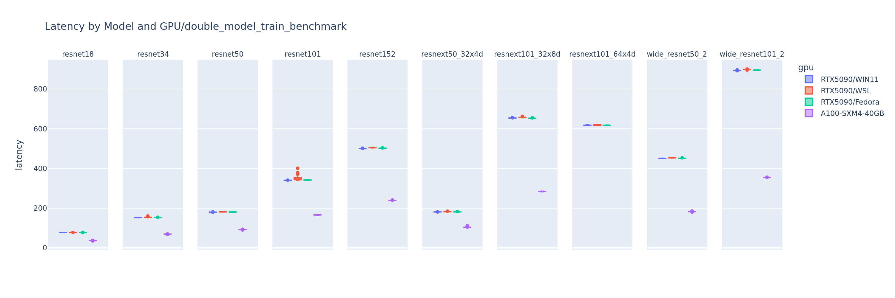
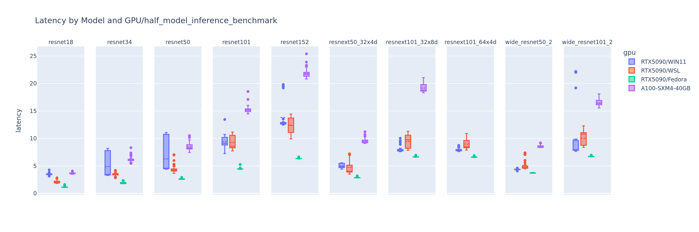
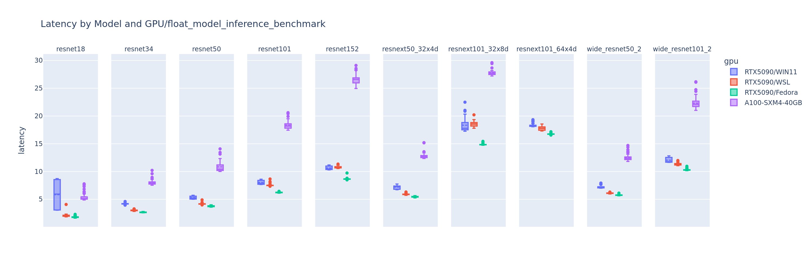
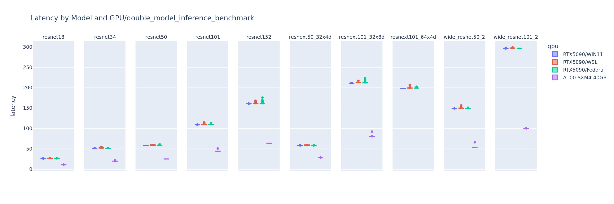
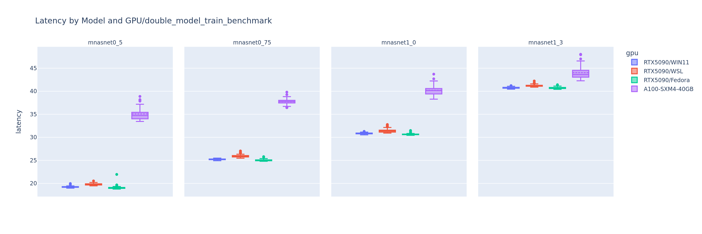
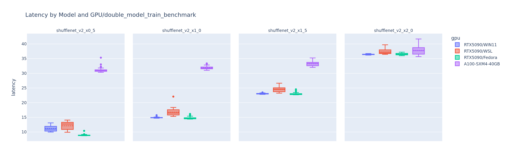
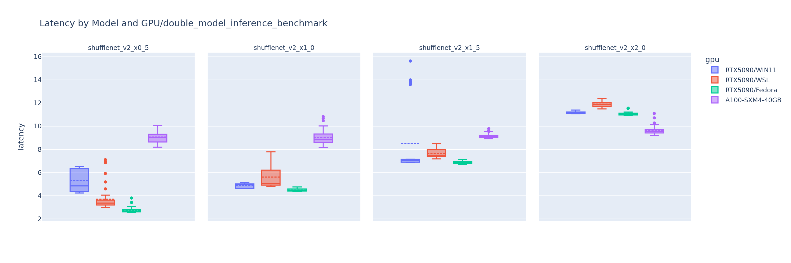

# About
Comparison of learning and inference speed of different GPU with various CNN models in __pytorch__

Forked from [_ryujaehun/pytorch-gpu-benchmark_](https://github.com/ryujaehun/pytorch-gpu-benchmark)

1. This repo mainly focuses on the performance of the RTX 5090.
2. I also compared the performance on Windows 11, Windows Subsystem for Linux (WSL), and Fedora 42 to determine which one performs best.
3. I used the A100 data as a reference.

# Specification
| Graphics Card Name |    A100-SMX4   |    RTX 5090    |
|:------------------:|:--------------:|:--------------:|
|    Architecture    |  NVIDIA Ampere |NVIDIA Blackwell|
|       Process      |       7nm      | 5nm(4N FinFET) |
|      Die Size      |     826mm²     |     750 mm²    |
|     Transistors    | 54,200 million | 92,200 million |
|     CUDA Cores     |   6912 Cores   |   21760 Cores  |
|    Tensor Cores    |    432 Cores   |    680 Cores   |
|     Clock(base)    |    1095 MHz    |    2017 MHz    |
|     FP16 (half)    |  77.97 TFLOPS  |  104.8 TFLOPS  |
|    FP32 (float)    |  19.49 TFLOPS  |  104.8 TFLOPS  |
|    FP64 (double)   |  9.746 TFLOPS  |  1.637 TFLOPS  |
|       Memory       |   40GB HBM2e   |   32GB GDDR7   |
|  Memory Interface  |    5120 bit    |     512 bit    |
|  Memory Bandwidth  |    1.56 TB/s   |    1.79 TB/s   |
|        TDP         |     400 W      |      575W      |
|       Price        |                |   $ 1,999 USD  |
|    Release Date    | May 14th, 2020 | Jan 30th, 2025 |

[_reference site_](https://www.techpowerup.com/gpu-specs/)

# About the benchmark
1. Single & multi GPU with batch size 12: compare training and inference speed of **SequeezeNet, VGG-16, VGG-19, ResNet18, ResNet34, ResNet50, ResNet101,
ResNet152, DenseNet121, DenseNet169, DenseNet201, DenseNet161 mobilenet mnasnet ... **
2. Experiments are performed on three types of the datatype. single-precision, double-precision, half-precision
3. making plot(plotly)

## Usage

`./test.sh`

##  Requirement
* python>=3.9(for latest PyTorch)
* torchvision
* torch>=1.0.0
* pandas
* psutil
* plotly(for plot)
* kaleido(for plot)
* cufflinks(for plot)

## Environment (on my device)

* Pytorch version `2.7.1`
* Number of GPUs on current device `1`
* CUDA version = `12.8`

## Change Log
* 2025/07/08
  * Addition result in RTX5090

## Contribute
If you want to contribute to the experiment in an additional environment, please contribute to the result csv files.

# Results

The full comparison figures can be found in the `./fig/5090` folder. You can modify `plot_comparison.ipynb` for your own purposes.

In this session, to simplify, I mainly use ResNet for demonstration.

## Training Performance

### Operating System

In terms of training, the differences across operating systems are minimal. Under half-precision, native Linux performs slightly better. As the precision increases to double-precision, the performance of all three becomes nearly identical.

### RTX5090 vs A100-SXM4-40GB
On the GPU side, the RTX 5090 outperforms the A100 in both half-precision and single-precision. However, in double-precision, the A100 holds a significant advantage due to its FP64 Tensor Core instructions, achieving more than twice the speed of the 5090.

## Inference Performance

### Operating System

For inference, the differences between operating systems become more pronounced, with native Linux showing a significant advantage. Under half-precision and single-precision, inference latency on Windows exhibits noticeably larger fluctuations. Interestingly, as the precision increases to double-precision, the performance across all three systems becomes nearly identical again.

### RTX5090 vs A100-SXM4-40GB

On the GPU side, the RTX 5090 outperforms the A100 in both half-precision and single-precision. However, in double-precision, the A100 holds a significant advantage due to its FP64 Tensor Core instructions, achieving more than twice the speed of the 5090.

## Discussion

### Training

**The conclusions discussed above do not apply universally and should also take model architecture into account.** For example, in double-precision training of MnasNet and ShuffleNetv2, the RTX5090 still holds a significant advantage. Lightweight networks like ShuffleNetV2 may not be able to fully utilize A100, limiting their performance advantages.

### Inference

In contrast, for double-precision inference with MnasNet and ShuffleNetV2, the performance gap between the RTX 5090 and A100 is not significant.

### Conclusion

Model complexity, precision requirements, memory access patterns, and Tensor Core utilization are the key determining factors. The A100 shows a clear advantage in large models, high-precision, and high-concurrency scenarios, while the RTX 5090 may be more efficient for lightweight models and small-batch tasks.

## Future Work

I look forward to running this benchmark on an H100 server, and it would be even better if someone could contribute the data.